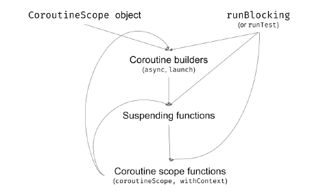
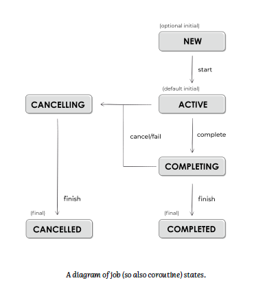

## Coroutine builders

- suspend 함수는 continuation 을 인자로 전달받아야 함  
  - 그래서 일반 함수로는 호출할 수 없고 다른 suspend 함수에 의해 호출되어야 함

  
- 그렇다면 맨 처음 시작지점은?
  - coroutine builder 에 의해 시작됨 
  - (앞선 예제들에서는 suspending main. 이것도 사실 coroutine builder by kotlin)


- 3가지 coroutine builder
  - launch
  - runBlocking
  - async

### launch builder

```kotlin

fun main() {
  GlobalScope.launch {
    delay(1000L)
    println("World!")
  }
  GlobalScope.launch {
    delay(1000L)
    println("World!")
  }
  GlobalScope.launch {
    delay(1000L)
    println("World!")
  }
  println("Hello,")
  Thread.sleep(2000L)
}
// Hello,
// (1 sec)
// World!
// World!
// World!

```

- CoroutineScope 인터페이스의 확장함수
  - 이는 structured concurrency 메카니즘의 중요한 요소(추후 설명)
  

- Thread.sleep() 호출하지 않으면, 스레드 바로 종료됨 
  - 왜냐하면 delay()는 스레드를 block 하는게 아니라 coroutine 을 suspend 하기에


- 그래서 launch 는 저렴한 daemon 스레드와 유사 
  - block 된 스레드를 유지하는 것보다 훨씬 저렴 

### runBlocking builder

```kotlin
fun main() {
    runBlocking {
        delay(1000L)
        println("World!")
    }
    runBlocking {
        delay(1000L)
        println("World!")
    }
    runBlocking {
        delay(1000L)
        println("World!")
    }
    println("Hello,")
}
// (1 sec)
// World!
// (1 sec)
// World!
// (1 sec)
// World!
// Hello,
```
- 스레드를 block 하지 않는 것이 국룰이지만, 필요한 경우가 있기에 위 builder 가 존재함
- 코루틴이 suspend 되는 시점에 스레드를 block 함
  - 그래서 위 코드의 delay()는 Thread.sleep() 과 동일하게 동작함

- 위 builder 는 main function 이나 unit test 에 활용 됨


- 그리고 앞서 배운 launch를 runBlocking을 활용하여 아래와 같이 수정할 수 있음 
```kotlin
fun main() = runBlocking {
    GlobalScope.launch {
        delay(1000L)
        println("World!")
    }
    GlobalScope.launch {
        delay(1000L)
        println("World!")
    }
    GlobalScope.launch {
        delay(1000L)
        println("World!")
    }
    println("Hello,")
    delay(2000L) // still needed
}
// Hello,
// (1 sec)
// World!
// World!
// World!

```

## async builder
```kotlin
fun main() = runBlocking {
    val resultDeferred: Deferred<Int> = GlobalScope.async {
        delay(1000L)
        42
    }
    // do other stuff...
    val result: Int = resultDeferred.await() // (1 sec)
    println(result) // 42
    // or just
    println(resultDeferred.await()) // 42
}

```
- launch 와 유사하지만, 리턴값이 존재하는 경우 사용함
- 반환되는 타입은 Deferred<T> 이고, await() 함수를 제공함
  - await() 호출시에 값이 준비되지 않으면 suspend  됨


### Structured Concurrency

- [참고](https://jaeyeong951.medium.com/structured-concurrency-%EC%9D%B4%ED%95%B4%ED%95%98%EA%B8%B0-392cc45d01df)

- 지금까지의 코드 예제들을 보면, runBlocking 과 delay 를 활용하여 다른 builder 들의 동작을 기다렸음


- 아래의 runBlocking() 구현을 보면, block 파라미터의 리시버타입으로 CoroutineScope 를 받음

```kotlin

fun <T> runBlocking(
    context: CoroutineContext = EmptyCoroutineContext,
    block: suspend CoroutineScope.() -> T
): T
fun CoroutineScope.launch(
    context: CoroutineContext = EmptyCoroutineContext,
    start: CoroutineStart = CoroutineStart.DEFAULT,
    block: suspend CoroutineScope.() -> Unit
): Job
fun <T> CoroutineScope.async(
    context: CoroutineContext = EmptyCoroutineContext,
    start: CoroutineStart = CoroutineStart.DEFAULT,
    block: suspend CoroutineScope.() -> T
): Deferred<T>

```

- 그렇기에 launch 나 async 의 GlobalScope 를 this 로 변경할 수 있고, 이는 runBlocking 과 부모 관계를 가지게 함
- 이와 같이 자식들이 부모의 scope 안에서 호출되는 것을 Structured Concurrency 라고 함
  - 자식은 부모의 context(scope 안에 있는) 를 상속받거나 수정할 수 있음
  - 부모는 자식들이 모두 완료될 때까지 중단 함
  - 부모가 취소되면 자식들도 취소됨
  - 자식이 에러가 나면 부모도 마찬가지로 에러
- 주목할점은 runBlocking 의 경우 CoroutineScope 의 확장함수가 아니기에 자식이 될 수 없음
```kotlin
fun main() = runBlokcing {
    this.launch{ ... }
    launch { ... }
    // delay 필요 없음
}
```

### The bigger picture

- 앞서 살펴보았듯이, builder 들은 CoroutineScope 에서 시작됨. (runBlocking 제외)
- 추후 살펴보겠지만 CoroutineScope 는 프레임워크에 의해 제공받기도 하고(Ktor 등등), 직접 선언할 수 도 있음 (예제에서는 runBlocking 활용) 

### Using coroutineScope

- suspending 함수 내부에서 scope를 활용하기 위해서는
  - coroutineScope 를 활용함
```kotlin
suspend fun main(): Unit = coroutineScope {
    launch {
        delay(1000L)
        println("World!")
    }
  println("Hello,")
}
```

### Summary


--- 

## Coroutine context

- CoroutineScope, coroutine builder, Continuation 등에서 모두 가지고 있음

````kotlin
public fun CoroutineScope.launch(
  context: CoroutineContext = EmptyCoroutineContext,
  start: CoroutineStart = CoroutineStart.DEFAULT,
  block: suspend CoroutineScope.() -> Unit
): Job { ... }

public interface CoroutineScope {
  public val coroutineContext: CoroutineContext
}

public interface Continuation<in T> {
  public val context: CoroutineContext
  public fun resumeWith(result: Result<T>)
}

````

### CoroutineContext interface

- map, set 과 같은 collection 과 유사 
- 요소들로 Job, CoroutineName, CoroutineDispatcher 등을 가질 수 있고 (이 요소들도 CoroutineContext)

```kotlin
fun main() {
    val name: CoroutineName = CoroutineName("A name")
    val element: CoroutineContext.Element = name
    val context: CoroutineContext = element
  
  
    val job: Job = Job()
    val jobElement: CoroutineContext.Element = job
    val jobContext: CoroutineContext = jobElement
}
```

### Finding elements in CoroutineContext

- collection 과 유사하기에, 키를 통해 요소들을 가져올 수 있음

```kotlin
fun contextEx2() {
    val ctx: CoroutineContext = CoroutineName("A name")
    
    val coroutineName: CoroutineName? = ctx[CoroutineName]
    // or ctx.get(CoroutineName)
    println(coroutineName?.name) // A name
  
    val job: Job? = ctx[Job] // or ctx.get(Job)
    println(job) // null
}
```

- 아래는 요소들 중 하나인 CoroutineName의 코드인데, 다른 요소들도 비슷한 구조임
```kotlin
data class CoroutineName(
    val name: String
) : AbstractCoroutineContextElement(CoroutineName) {
    companion object Key : CoroutineContext.Key<CoroutineName>
    override fun toString(): String = "CoroutineName($name)"
}

```

### Adding, Empty, Subtracting, Folding contexts

- 2개의 다른 키를 가진 요소들을 더하기 연산자를 통해 합칠 수 있음
- 만약 같은 키를 가진 요소를 더하게 되면 새로운 요소가 반영됨


- EmptyCoroutineContext 를 통해 빈 context 생성 가능 

- 마찬가지로 빼기 연산자도 활용 가능

```kotlin
fun main() {
    val ctx1: CoroutineContext = CoroutineName("Name1")
    println(ctx1[CoroutineName]?.name) // Name1
    println(ctx1[Job]?.isActive) // null
    
    val ctx2: CoroutineContext = Job()
    println(ctx2[CoroutineName]?.name) // null
    println(ctx2[Job]?.isActive) // true, because "Active"
    // is the default state of a job created this way
    
    val ctx3 = ctx1 + ctx2
    println(ctx3[CoroutineName]?.name) // Name1
    println(ctx3[Job]?.isActive) // true
}

```

- 마찬가지로 fold 기능도 지원함

```kotlin
fun main() {
    val ctx = CoroutineName("Name1") + Job()
    ctx.fold("") { acc, element -> "$acc$element " }
        .also(::println)
    // CoroutineName(Name1) JobImpl{Active}@dbab622e
    
    val empty = emptyList<CoroutineContext>()
    ctx.fold(empty) { acc, element -> acc + element }
        .joinToString()
        .also(::println)
    // CoroutineName(Name1), JobImpl{Active}@dbab622e
}
```


### Coroutine context and builders

- Coroutine context 는 데이터를 점유하거나 전달하는 방식
- 부모-자식 관계를 가지는 코루틴의 경우 Coroutine context 를 상속받거나 수정 가능 

```kotlin
fun CoroutineScope.log(msg: String) {
    val name = coroutineContext[CoroutineName]?.name
    println("[$name] $msg")
}

fun main() = runBlocking(CoroutineName("main")) {
    log("Started") // [main] Started
    
    val v1 = async(CoroutineName("c1")) {
        delay(500)
        log("Running async") // [c1] Running async
        42
    }
    
    launch(CoroutineName("c2")) {
        delay(1000)
        log("Running launch") // [c2] Running launch
    }
    log("The answer is ${v1.await()}")
    // [main] The answer is 42
}
```


### Accessing context in suspending function

- suspend 함수의 경우에는? 
  - Continuation 에서 context를 참조하고 있기에 접근 가능함 

```kotlin

suspend fun printName() {
    println(coroutineContext[CoroutineName]?.name)
}
suspend fun main() = withContext(CoroutineName("Outer")) {
    printName() // Outer
    launch(CoroutineName("Inner")) {
        printName() // Inner
    }
    delay(10)
    printName() // Outer
}

```

### Creating our own context
- 아래와 같이 커스텀하게 context를 정의할 수 있다

```kotlin
class MyCustomContext : CoroutineContext.Element {
    override val key: CoroutineContext.Key<*> = Key
    companion object Key :
        CoroutineContext.Key<MyCustomContext>
}
```

- 아래는 예제코드

```kotlin
class CounterContext(
    private val name: String
) : CoroutineContext.Element {
    override val key: CoroutineContext.Key<*> = Key
    companion object Key :CoroutineContext.Key<CounterContext>
    
    private var nextNumber = 0
    
    fun printNext() {
        println("$name: $nextNumber")
        nextNumber++
    }
}

suspend fun printNext() {
    coroutineContext[CounterContext]?.printNext()
}

suspend fun main(): Unit =
    withContext(CounterContext("Outer")) {
        printNext() // Outer: 0
        launch {
            printNext() // Outer: 1
            launch {
                printNext() // Outer: 2
            }
            launch(CounterContext("Inner")) {
                printNext() // Inner: 0
                printNext() // Inner: 1
                launch {
                    printNext() // Inner: 2
                }
            }
        }
        printNext() // Outer: 3
    }
```

- DI를 구현하는데 활용되기도 함

```kotlin
abstract class UuidProviderContext : CoroutineContext.Element {
  abstract fun nextUuid(): String
  override val key: CoroutineContext.Key<*> = Key
  companion object Key : CoroutineContext.Key<UuidProviderContext>
}

class RealUuidProviderContext : UuidProviderContext() {
  override fun nextUuid(): String =
    UUID.randomUUID().toString()
}
class FakeUuidProviderContext(
  private val fakeUuid: String
) : UuidProviderContext() {
  override fun nextUuid(): String = fakeUuid
}


data class User(val id: String, val name: String)

suspend fun main2() {
  // production case
  withContext(RealUuidProviderContext()) {
    println(makeUser("Michał")) // e.g. User(id=d260482a-..., name=Michał)
  }

  // test case
  withContext(FakeUuidProviderContext("FAKE_UUID")) {
    val user = makeUser("Michał")
    println(user) // User(id=FAKE_UUID, name=Michał)
  }
}

// function under test
suspend fun makeUser(name: String) = User(
  id = nextUuid(),
  name = name
)

suspend fun nextUuid(): String =
  checkNotNull(coroutineContext[UuidProviderContext]) {
    "UuidProviderContext not present"
  }.nextUuid()


```

### Summary
CoroutineContext 는
- map, set 과 같은 collection 과 유사함
- 가지는 각 요소들도 CoroutineContext 임
- 각 요소들은 Key를 가지며, 이를 이용해 식별할 수 있음
- 오브젝트들의 그룹이라고 봐도 되면 코루틴에게 이 오브젝트 그룹을 전달하는 방식임
- 이 오브젝트들은 코루틴에 의해 관리되며, 어떻게 코루틴이 동작하는지에 관여함


## Jobs and awaiting children

Structured Concurrency 설명하는 부분에서 언급되었던, 부모-자식 관계는 다음과 같은 조건을 만족시킴
- 자식은 부모의 context 를 물려받음
- 부모는 모든 자식 coroutine 이 끝날때 까지 suspend 됨
- 부모가 cancel 되면, 자식 coroutine 들도 모두 cancel 됨
- 자식이 destroy 되면, 부모도 destroy 됨

위 4가지 조건들 중 1번은 context 에 의해 설명됨  
나머지 3가지는 이제 설명할 Job 과 관련되어 있음  

### What is Job?

job 의 라이프 사이클은 아래와 같음



- coroutine builder 에 의해 coroutine 을 시작하면, active 상태임
- active 상태에서는 자식 coroutine 을 만들 수 있음
- 만약 lazily 하게 시작되는 coroutine 의 경우, new 상태임. active 상태로 변환하기 위해서는 start 해야 댐
- coroutine 을 완료하면, completing 상태로 바뀜. 이 상태에서 자식 coroutine 을 기다림
- 자식 coroutine 까지 모두 종료되면, completed 로 바뀜
- cancel 되거나 fail 되면, canceling 상태로 바뀜. 이 상태에서 점유중인 자원을 해제하거나, 정리할 기회가 있음

```kotlin
suspend fun main() = coroutineScope {
    val job = Job()
    println(job)
    job.complete()
    println(job)

    // launch is initially active by default
    val activeJob = launch {
        delay(1000)
    }
    println(activeJob) // StandaloneCoroutine{Active}@ADD
    // here we wait until this job is done
    activeJob.join() // (1 sec)
    println(activeJob) // StandaloneCoroutine{Completed}@ADD

    
    // launch started lazily is in New state
    val lazyJob = launch(start = CoroutineStart.LAZY) {
        delay(1000)
    }
    println(lazyJob) // LazyStandaloneCoroutine{New}@ADD
    // we need to start it, to make it active
    lazyJob.start()
    println(lazyJob) // LazyStandaloneCoroutine{Active}@ADD
    lazyJob.join() // (1 sec)
    println(lazyJob) //LazyStandaloneCoroutine{Completed}@ADD
}
```

### Coroutine builders create their jobs based on their parent job

launch, async 와 같은 coroutine builder 의 리턴값의 경우 Job 을 구현하고 있음  
extension property 가 있어, coroutine scope 에서 쉽게 접근 가능함  

```kotlin
fun main(): Unit = runBlocking {
    print(coroutineContext.job.isActive)
}
```

**job의 경우 coroutine context 중에서 유일하게 상속되지 않는 것이다**
- 각자의 job을 새로 만든다!
- 그리고 argument 로 입력받은 job이나, 부모 coroutine 의 job 이 새로 만든 job의 부모 job으로 기록됨  
- 이렇게 부모 job 은 자식 job 을 참조할 수 있고, 자식은 job 도 부모 job 을 참조할 수 있기에, cancellation 이나 exception handling 이 용이해짐

만약 새로운 job 의 부모가 실제 부모 코루틴의 job이 아닌 경우, structured concurrency 는 무너짐

```kotlin
fun main(): Unit = runBlocking {
    launch(Job()) { // 새로운 job 이 부모 코루틴의 job 을 대체함 
        delay(100)
        println("Will not be printed")
    }
}
// 바로 종료됨
```


### Waiting for children

job 의 join 함수를 사용해 자식 coroutine 들이 종료되길 기다릴 수 있음
```kotiln
fun main(): Unit = runBlocking {
    val job1 = launch {
        delay(1000)
        println("Test1")
    }
    val job2 = launch {
        delay(2000)
        println("Test2")
    }
    
    job1.join()
    job2.join()
    println("All tests are done")
}
```

job 은 children 속성을 가지고 있어, 이를 이용하여 자식 job 에게 접근 할 수도 있음


### Job factory function
Job() 팩토리 함수를 이용하여, 어느 코루틴과 무관한 job을 생성할 수 있음  
만약 위 함수를 이용하여 생성한 job을 이용하여 코루틴을 생성하게 되면, 기존 부모 코루틴과의 관계가 없어지게 됨... 주의 요망  

그래서 위 함수를 사용하게 된다면 아래와 같이 사용해야 댐

```kotlin
suspend fun main(): Unit = coroutineScope {
  val job = Job()
  launch(job) { // the new job replaces one from parent
    delay(1000)
    println("Text 1")
  }
  launch(job) { // the new job replaces one from parent
    delay(2000)
    println("Text 2")
  }
  job.children.forEach { it.join() }
}
// (1 sec)
// Text 1
// (1 sec)
// Text 2
```

위 함수의 경우 반환 타입은 CompletableJob 임    


기존 Job 에서 추가적으로 구현된 기능이 있음 
- complete()
  - job 을 complete 하기 위해 호출함 
  - 호출되면 자식 코루틴을 생성할 수 없음
  - 만약 job 이 complete 되면 true 반환. 이미 complete 된 상태면 false 반환

- completeExceptionally()
  - job 을 exception 과 함께 complete 함
  - 이는 모든 자식 코루틴은 즉시 cancelled 됨을 의미 함
  - 반환 값 로직은 바로 직전 함수와 동일함

위 기능은 주로 마지막 코루틴을 시작하고 호출함  
주로 job 과 같이 사용함
- job.complet() 하고 job.join()으로 간단하게 사용하기도 함

```kotlin
suspend fun main___(): Unit = coroutineScope {
  val job = Job()
  launch(job) { // the new job replaces one from parent
    delay(1000)
    println("Text 1")
  }
  launch(job) { // the new job replaces one from parent
    delay(2000)
    println("Text 2")
  }
  job.complete()
  job.join()
  println("All tests are done")
}
```

## Cancellation

cancellation 은 매우 중요한 기능임. 그냥 스레드를 kill 하는 것은 연결을 종료하거나 자원 해제와 같은 작업을 하지 않기 때문  

### Basic cancellation
Job 은 cancel() 함수를 지원함. 이는 아래 작용을 트리거함  
- 코루틴은 첫 suspension point 에서 종료됨  
- 만약 자식 코루틴들이 있으면, 마찬가지로 cancel 됨
- cancel 되면, 다른 새로운 자식 코루틴을 생성할 수 없음(Cancelling 상태이기 때문)

```kotlin
suspend fun main(): Unit = coroutineScope {
    val job = launch {
        repeat(1_000) { i ->
            delay(200)
            println("Printing $i")
        }
    }
    delay(1100)
    job.cancel()
    job.join()
    println("Cancelled successfully")
}
// Printing 0
// Printing 1
// Printing 2
// Printing 3
// Printing 4
// Cancelled successfully
```

만약 join() 을 호출하지 않는다면, 코루틴이 cancel 될 때까지 suspend 되지 않기 때문에, 중간에 "Cancelld suscessfully"가 호출될 것임  
cancel 과 join 이 같이 호출되는 경우가 많기에, cancelAndJoin() 이라는 함수도 있음  

### How does cancellation work?
job 이 cancel 되면, "Cancelling" 상태로 바뀌면서, 첫 suspending point 에서 CancellationException 이 throw 됨  
그래서 finally block 에서 자원을 해제할 수 있음  

```kotlin
suspend fun main(): Unit = coroutineScope {
  val job = Job()
  launch(job) {
    try {
      delay(Random.nextLong(2000))
      println("Done")
    } finally {
      print("Will always be printed")
    }
  }
  delay(1000)
  job.cancelAndJoin()
}
// Will always be printed
// (or)
// Done
// Will always be printed
```

### Just one more call
CancellationException 이 throw 된 상태에서, 다른 코루틴은 생성할 수 없음  
만약 생성하려고 한다면 무시됨 
다른 suspending call 을 생성하면, CancellationException 이 발생함  

만약 cancelling 상태에서, 또 다른 suspending call 을 부득이 하게 생성해야 한다면, withContext(NonCancellable) 함수를 이용하자  

```kotlin
suspend fun main(): Unit = coroutineScope {
    val job = Job()
    launch(job) {
        try {
            delay(200)
            println("Coroutine finished")
        } finally {
            println("Finally")
            withContext(NonCancellable) {
                delay(1000L)
                println("Cleanup done")
            }
        }
    }
    delay(100)
    job.cancelAndJoin()
    println("Done")
}
// Finally
// CleanupDone
// Done
```

### InvokeOnCompletion
job이 "Cancelled" 나 "Completed" 상태에 도딜 했을때 handler 를 등록하게 해주는 함수임  

```kotlin
suspend fun main(): Unit = coroutineScope {
    val job = launch {
        delay(1000)
    }
    job.invokeOnCompletion { exception: Throwable? ->
        println("Finished")
    }
    delay(400)
    job.cancelAndJoin()
}
// Finished
```

handler 의 파라미터는 exception 이며, 아래와 같은 경우가 있을 수 있음 
- 만약 job이 예외없이 끝났다면, null
- 만약 job이 cancel 되었다면, CancellationException
- 코루틴을 종료시킨 exception

handler 가 등록되기도 전에, job 이 끝났다면, handler는 바로 실행됨 

```kotlin
suspend fun main(): Unit = coroutineScope {
    val job = launch {
        delay(2000)
        println("Finished")
    }
    delay(800)
    job.invokeOnCompletion { exception: Throwable? ->
        println("Will always be printed")
        println("The exception was: $exception")
    }
    delay(800)
    job.cancelAndJoin()
}
// Will always be printed
// The exception was:
// kotlinx.coroutines.JobCancellationException
// (or)
// Finished
// Will always be printed
// The exception was null
```

### Stopping the unstoppable

cancellation 은 suspension point 에서 발생함  
그렇기에 위 포인트가 없으면 동작하지 않음...  

만약 suspension point 가 없는데 cancel 을 활용하고 싶다면?
1. yield() 함수를 활용할 수 있다. 이 함수는 suspend 하고 바로 resume 한다. CPU-intensive 하거나 time-intensive 한 연산의 중간중간에 yield() 끼워넣는 것은 고려해볼 수 있음

```kotlin
suspend fun main(): Unit = coroutineScope {
    val job = Job()
    launch(job) {
        repeat(1_000) { i ->
            Thread.sleep(200)
            yield()
            println("Printing $i")
        }
    }
    delay(1100)
    job.cancelAndJoin()
    println("Cancelled successfully")
    delay(1000)
}
// Printing 0
// Printing 1
// Printing 2
// Printing 3
// Printing 4
// Cancelled successfully
```

2. 다른 방법은 state 를 추적하는 방법임. coroutineContext 에서 Job의 상태를 파악할 수 있음. isActive 필드나 ensureActive() 함수를 활용 할 수 있음  

```kotlin
suspend fun main(): Unit = coroutineScope {
    val job = Job()
    launch(job) {
        do {
            Thread.sleep(200)
            println("Printing")
        } while (isActive)
    }
    delay(1100)
    job.cancelAndJoin()
    println("Cancelled successfully")
}
// Printing
// Printing
// Printing
// Printing
// Printing
// Printing
// Cancelled successfully
```

```kotlin
suspend fun main(): Unit = coroutineScope {
    val job = Job()
    launch(job) {
        repeat(1000) { num ->
            Thread.sleep(200)
            ensureActive()
            println("Printing $num")
        }
    }
    delay(1100)
    job.cancelAndJoin()
    println("Cancelled successfully")
}
// Printing 0
// Printing 1
// Printing 2
// Printing 3
// Printing 4
// Cancelled successfully
```

yield() 와 ensureActive() 는 얼핏 보기에 유사한 기능을 하는 것 같지만 매우 다르다!
- ensureActive() 는 단순히 job 이 active 하지 않으면 예외를 던지는 기능을 한다. 가볍기에 이 함수를 사용하는것이 권장 됨
- 그러나 yield() 의 경우에는, top-level suspension function 으로 실제로 suspend 되고 resume 되기 때문에 실행되는 스레드가 변경될 수 있음ss


