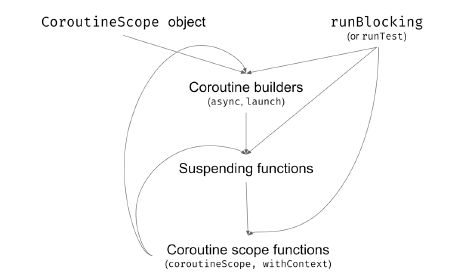

## Coroutine builders

- suspend 함수는 continuation 을 인자로 전달받아야 함  
  - 그래서 일반 함수로는 호출할 수 없고 다른 suspend 함수에 의해 호출되어야 함

  
- 그렇다면 맨 처음 시작지점은?
  - coroutine builder 에 의해 시작됨 
  - (앞선 예제들에서는 suspending main. 이것도 사실 coroutine builder by kotlin)


- 3가지 coroutine builder
  - launch
  - runBlocking
  - async

### launch builder

```kotlin

fun main() {
  GlobalScope.launch {
    delay(1000L)
    println("World!")
  }
  GlobalScope.launch {
    delay(1000L)
    println("World!")
  }
  GlobalScope.launch {
    delay(1000L)
    println("World!")
  }
  println("Hello,")
  Thread.sleep(2000L)
}
// Hello,
// (1 sec)
// World!
// World!
// World!

```

- CoroutineScope 인터페이스의 확장함수
  - 이는 structured concurrency 메카니즘의 중요한 요소(추후 설명)
  

- Thread.sleep() 호출하지 않으면, 스레드 바로 종료됨 
  - 왜냐하면 delay()는 스레드를 block 하는게 아니라 coroutine 을 suspend 하기에


- 그래서 launch 는 저렴한 daemon 스레드와 유사 
  - block 된 스레드를 유지하는 것보다 훨씬 저렴 

### runBlocking builder

```kotlin
fun main() {
    runBlocking {
        delay(1000L)
        println("World!")
    }
    runBlocking {
        delay(1000L)
        println("World!")
    }
    runBlocking {
        delay(1000L)
        println("World!")
    }
    println("Hello,")
}
// (1 sec)
// World!
// (1 sec)
// World!
// (1 sec)
// World!
// Hello,
```
- 스레드를 block 하지 않는 것이 국룰이지만, 필요한 경우가 있기에 위 builder 가 존재함
- 코루틴이 suspend 되는 시점에 스레드를 block 함
  - 그래서 위 코드의 delay()는 Thread.sleep() 과 동일하게 동작함

- 위 builder 는 main function 이나 unit test 에 활용 됨


- 그리고 앞서 배운 launch를 runBlocking을 활용하여 아래와 같이 수정할 수 있음 
```kotlin
fun main() = runBlocking {
    GlobalScope.launch {
        delay(1000L)
        println("World!")
    }
    GlobalScope.launch {
        delay(1000L)
        println("World!")
    }
    GlobalScope.launch {
        delay(1000L)
        println("World!")
    }
    println("Hello,")
    delay(2000L) // still needed
}
// Hello,
// (1 sec)
// World!
// World!
// World!

```

## async builder
```kotlin
fun main() = runBlocking {
    val resultDeferred: Deferred<Int> = GlobalScope.async {
        delay(1000L)
        42
    }
    // do other stuff...
    val result: Int = resultDeferred.await() // (1 sec)
    println(result) // 42
    // or just
    println(resultDeferred.await()) // 42
}

```
- launch 와 유사하지만, 리턴값이 존재하는 경우 사용함
- 반환되는 타입은 Deferred<T> 이고, await() 함수를 제공함
  - await() 호출시에 값이 준비되지 않으면 suspend  됨


### Structured Concurrency

- [참고](https://jaeyeong951.medium.com/structured-concurrency-%EC%9D%B4%ED%95%B4%ED%95%98%EA%B8%B0-392cc45d01df)

- 지금까지의 코드 예제들을 보면, runBlocking 과 delay 를 활용하여 다른 builder 들의 동작을 기다렸음


- 아래의 runBlocking() 구현을 보면, block 파라미터의 리시버타입으로 CoroutineScope 를 받음

```kotlin

fun <T> runBlocking(
    context: CoroutineContext = EmptyCoroutineContext,
    block: suspend CoroutineScope.() -> T
): T
fun CoroutineScope.launch(
    context: CoroutineContext = EmptyCoroutineContext,
    start: CoroutineStart = CoroutineStart.DEFAULT,
    block: suspend CoroutineScope.() -> Unit
): Job
fun <T> CoroutineScope.async(
    context: CoroutineContext = EmptyCoroutineContext,
    start: CoroutineStart = CoroutineStart.DEFAULT,
    block: suspend CoroutineScope.() -> T
): Deferred<T>

```

- 그렇기에 launch 나 async 의 GlobalScope 를 this 로 변경할 수 있고, 이는 runBlocking 과 부모 관계를 가지게 함
- 이와 같이 자식들이 부모의 scope 안에서 호출되는 것을 Structured Concurrency 라고 함
  - 자식은 부모의 context(scope 안에 있는) 를 상속받거나 수정할 수 있음
  - 부모는 자식들이 모두 완료될 때까지 중단 함
  - 부모가 취소되면 자식들도 취소됨
  - 자식이 에러가 나면 부모도 마찬가지로 에러
- 주목할점은 runBlocking 의 경우 CoroutineScope 의 확장함수가 아니기에 자식이 될 수 없음
```kotlin
fun main() = runBlokcing {
    this.launch{ ... }
    launch { ... }
    // delay 필요 없음
}
```

### The bigger picture

- 앞서 살펴보았듯이, builder 들은 CoroutineScope 에서 시작됨. (runBlocking 제외)
- 추후 살펴보겠지만 CoroutineScope 는 프레임워크에 의해 제공받기도 하고(Ktor 등등), 직접 선언할 수 도 있음 (예제에서는 runBlocking 활용) 

### Using coroutineScope

- suspending 함수 내부에서 scope를 활용하기 위해서는
  - coroutineScope 를 활용함
```kotlin
suspend fun main(): Unit = coroutineScope {
    launch {
        delay(1000L)
        println("World!")
    }
  println("Hello,")
}
```

### Summary


--- 

## Coroutine context

- CoroutineScope, coroutine builder, Continuation 등에서 모두 가지고 있음

````kotlin
public fun CoroutineScope.launch(
  context: CoroutineContext = EmptyCoroutineContext,
  start: CoroutineStart = CoroutineStart.DEFAULT,
  block: suspend CoroutineScope.() -> Unit
): Job { ... }

public interface CoroutineScope {
  public val coroutineContext: CoroutineContext
}

public interface Continuation<in T> {
  public val context: CoroutineContext
  public fun resumeWith(result: Result<T>)
}

````

### CoroutineContext interface

- map, set 과 같은 collection 과 유사 
- 요소들로 Job, CoroutineName, CoroutineDispatcher 등을 가질 수 있고 (이 요소들도 CoroutineContext)

```kotlin
fun main() {
    val name: CoroutineName = CoroutineName("A name")
    val element: CoroutineContext.Element = name
    val context: CoroutineContext = element
  
  
    val job: Job = Job()
    val jobElement: CoroutineContext.Element = job
    val jobContext: CoroutineContext = jobElement
}
```

### Finding elements in CoroutineContext

- collection 과 유사하기에, 키를 통해 요소들을 가져올 수 있음

```kotlin
fun contextEx2() {
    val ctx: CoroutineContext = CoroutineName("A name")
    
    val coroutineName: CoroutineName? = ctx[CoroutineName]
    // or ctx.get(CoroutineName)
    println(coroutineName?.name) // A name
  
    val job: Job? = ctx[Job] // or ctx.get(Job)
    println(job) // null
}
```

- 아래는 요소들 중 하나인 CoroutineName의 코드인데, 다른 요소들도 비슷한 구조임
```kotlin
data class CoroutineName(
    val name: String
) : AbstractCoroutineContextElement(CoroutineName) {
    companion object Key : CoroutineContext.Key<CoroutineName>
    override fun toString(): String = "CoroutineName($name)"
}

```

### Adding, Empty, Subtracting, Folding contexts

- 2개의 다른 키를 가진 요소들을 더하기 연산자를 통해 합칠 수 있음
- 만약 같은 키를 가진 요소를 더하게 되면 새로운 요소가 반영됨


- EmptyCoroutineContext 를 통해 빈 context 생성 가능 

- 마찬가지로 빼기 연산자도 활용 가능

```kotlin
fun main() {
    val ctx1: CoroutineContext = CoroutineName("Name1")
    println(ctx1[CoroutineName]?.name) // Name1
    println(ctx1[Job]?.isActive) // null
    
    val ctx2: CoroutineContext = Job()
    println(ctx2[CoroutineName]?.name) // null
    println(ctx2[Job]?.isActive) // true, because "Active"
    // is the default state of a job created this way
    
    val ctx3 = ctx1 + ctx2
    println(ctx3[CoroutineName]?.name) // Name1
    println(ctx3[Job]?.isActive) // true
}

```

- 마찬가지로 fold 기능도 지원함

```kotlin
fun main() {
    val ctx = CoroutineName("Name1") + Job()
    ctx.fold("") { acc, element -> "$acc$element " }
        .also(::println)
    // CoroutineName(Name1) JobImpl{Active}@dbab622e
    
    val empty = emptyList<CoroutineContext>()
    ctx.fold(empty) { acc, element -> acc + element }
        .joinToString()
        .also(::println)
    // CoroutineName(Name1), JobImpl{Active}@dbab622e
}
```


### Coroutine context and builders

- Coroutine context 는 데이터를 점유하거나 전달하는 방식
- 부모-자식 관계를 가지는 코루틴의 경우 Coroutine context 를 상속받거나 수정 가능 

```kotlin
fun CoroutineScope.log(msg: String) {
    val name = coroutineContext[CoroutineName]?.name
    println("[$name] $msg")
}

fun main() = runBlocking(CoroutineName("main")) {
    log("Started") // [main] Started
    
    val v1 = async(CoroutineName("c1")) {
        delay(500)
        log("Running async") // [c1] Running async
        42
    }
    
    launch(CoroutineName("c2")) {
        delay(1000)
        log("Running launch") // [c2] Running launch
    }
    log("The answer is ${v1.await()}")
    // [main] The answer is 42
}
```


### Accessing context in suspending function

- suspend 함수의 경우에는? 
  - Continuation 에서 context를 참조하고 있기에 접근 가능함 

```kotlin

suspend fun printName() {
    println(coroutineContext[CoroutineName]?.name)
}
suspend fun main() = withContext(CoroutineName("Outer")) {
    printName() // Outer
    launch(CoroutineName("Inner")) {
        printName() // Inner
    }
    delay(10)
    printName() // Outer
}

```

### Creating our own context
- 아래와 같이 커스텀하게 context를 정의할 수 있다

```kotlin
class MyCustomContext : CoroutineContext.Element {
    override val key: CoroutineContext.Key<*> = Key
    companion object Key :
        CoroutineContext.Key<MyCustomContext>
}
```

- 아래는 예제코드

```kotlin
class CounterContext(
    private val name: String
) : CoroutineContext.Element {
    override val key: CoroutineContext.Key<*> = Key
    companion object Key :CoroutineContext.Key<CounterContext>
    
    private var nextNumber = 0
    
    fun printNext() {
        println("$name: $nextNumber")
        nextNumber++
    }
}

suspend fun printNext() {
    coroutineContext[CounterContext]?.printNext()
}

suspend fun main(): Unit =
    withContext(CounterContext("Outer")) {
        printNext() // Outer: 0
        launch {
            printNext() // Outer: 1
            launch {
                printNext() // Outer: 2
            }
            launch(CounterContext("Inner")) {
                printNext() // Inner: 0
                printNext() // Inner: 1
                launch {
                    printNext() // Inner: 2
                }
            }
        }
        printNext() // Outer: 3
    }
```

- DI를 구현하는데 활용되기도 함

```kotlin
abstract class UuidProviderContext : CoroutineContext.Element {
  abstract fun nextUuid(): String
  override val key: CoroutineContext.Key<*> = Key
  companion object Key : CoroutineContext.Key<UuidProviderContext>
}

class RealUuidProviderContext : UuidProviderContext() {
  override fun nextUuid(): String =
    UUID.randomUUID().toString()
}
class FakeUuidProviderContext(
  private val fakeUuid: String
) : UuidProviderContext() {
  override fun nextUuid(): String = fakeUuid
}


data class User(val id: String, val name: String)

suspend fun main2() {
  // production case
  withContext(RealUuidProviderContext()) {
    println(makeUser("Michał")) // e.g. User(id=d260482a-..., name=Michał)
  }

  // test case
  withContext(FakeUuidProviderContext("FAKE_UUID")) {
    val user = makeUser("Michał")
    println(user) // User(id=FAKE_UUID, name=Michał)
  }
}

// function under test
suspend fun makeUser(name: String) = User(
  id = nextUuid(),
  name = name
)

suspend fun nextUuid(): String =
  checkNotNull(coroutineContext[UuidProviderContext]) {
    "UuidProviderContext not present"
  }.nextUuid()


```

### Summary
CoroutineContext 는
- map, set 과 같은 collection 과 유사함
- 가지는 각 요소들도 CoroutineContext 임
- 각 요소들은 Key를 가지며, 이를 이용해 식별할 수 있음
- 오브젝트들의 그룹이라고 봐도 되면 코루틴에게 이 오브젝트 그룹을 전달하는 방식임
- 이 오브젝트들은 코루틴에 의해 관리되며, 어떻게 코루틴이 동작하는지에 관여함


## Jobs and awaiting children


## Cancellation

