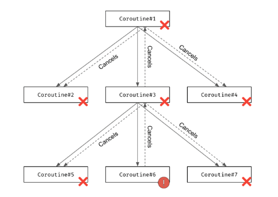
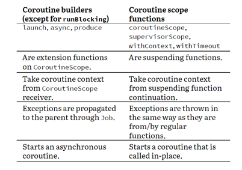

## Exception handling

코루틴이 Exception 을 받으면, 자기 자신을 cancel 하고 부모 코루틴에게 전파함  
아래 이미지와 같이 Exception 이 전파되는 것을 볼 수 있음




### Stop breaking my coroutines

아래와 같이 try-catch 처리를 하는 것은 작동하지 않음  
Exception 의 전파는 job을 통해서 이루어지기 때문임  

```kotlin
fun stopBreakingMyCoroutines() {
    runBlocking {
        // Don't wrap in a try-catch here. It will be ignored.
        try {
            launch {
                delay(1000)
                throw Error("Some error")
            }
        } catch (e: Throwable) { // nope, does not help here
            println("Will not be printed")
        }

        launch {
            delay(2000)
            println("Will not be printed")
        }
    }
}
```

### SupervisorJob

SupervisorJob 은 특별한 Job 으로 자식 코루틴의 모든 Exception 을 무시함 

```kotlin
fun supervisorJobExample() {
    runBlocking {
        val scope = CoroutineScope(SupervisorJob())
        scope.launch {
            delay(1000)
            throw Error("Some error")
        }
        scope.launch {
            delay(2000)
            println("Will be printed")
        }
        delay(3000)
    }
}
```

아래는 흔히 하는 실수로, 기대하는 대로 동작하지 않음  
앞서 여러번 나왔던 내용인데, 코루틴 빌더의 인자로 job 타입의 context를 넣게 되면 해당 코루틴의 부모코루틴의 job 으로 인식함

```kotlin
fun supervisorJobExampleNotGood() {
    runBlocking {
        // Don't do that, SupervisorJob with one children
        // and no parent works similar to just Job
        launch(SupervisorJob()) { // 1
            launch {
                delay(1000)
                throw Error("Some error")
            }
            launch {
                delay(2000)
                println("Will not be printed")
            }
        }
        delay(3000)
    }
}
```

### SupervisorScope

예외의 전파를 막는 또 다른 방법은 코루틴 빌더를 `supervisorScope`로 감싸는 것임  
아래와 같이 사용하면 자식 코루틴들의 예외가 전파되지 않음  

```kotlin
fun supervisorScopeExample() {
    runBlocking {
        supervisorScope {
            launch {
                delay(1000)
                throw Error("Some error")
            }
            launch {
                delay(2000)
                println("Will be printed")
            }
        }
        delay(1000)
        println("Done")
    }
    // Exception...
    // Will be printed
    // (1 sec)
    // Done
}
```

앞서 설명한 부적절한 supervisorJob 의 사용 내용과 유사하게, 아래와 같은 사용도 부적절함  
```kotlin
// DON'T DO THAT!
suspend fun sendNotifications(
    notifications: List<Notification>
) = withContext(SupervisorJob()) {
    for (notification in notifications) {
        launch {
            client.send(notification)
        }
    }
}
```

### Await

async 코루틴 빌더에서 Exception 이 발생하는 경우에는 어떻게 될까?  
아래 예제를 살펴보면, 부모 코루틴은 supervisorJob 을 가지고 있고, 자식 코루틴 중 async 로 시작된 코루틴 중 하나가 예외를 발생시켰음  
이와 같은 경우 await() 의 리턴값으로 Exception 이 반환됨

```kotlin
    class MyException : Throwable()
    suspend fun main() = supervisorScope {
        val str1 = async<String> {
            delay(1000)
            throw MyException()
        }
        val str2 = async {
            delay(2000)
            "Text2"
        }
        try {
            println(str1.await())
        } catch (e: MyException) {
            println(e)
        }
        println(str2.await())
    }
    // MyException
    // Text2a
```

### CancellationException does not propagate to its parent

만약 코루틴이 유발한 Exception이 `CancellationException` 이라면, 부모 코루틴에게 전파되지 않음  

```kotlin
    object MyNonPropagatingException : CancellationException()
    suspend fun main(): Unit = coroutineScope {
        launch { // 1
            launch { // 2
                delay(2000)
                println("Will not be printed")
            }
            throw MyNonPropagatingException // 3
        }
        launch { // 4
            delay(2000)
            println("Will be printed")
        }
    }
    // (2 sec)
    // Will be printed
```

### Coroutine exception handler

`CoroutineExceptionHandler` 를 통해 예외가 발생할 때 기본적으로 동작할 코드를 설정할 수 있음  
아래와 같이 사용할 수 있음 

```kotlin
    fun main(): Unit = runBlocking {
        val handler =
            CoroutineExceptionHandler { ctx, exception ->
                println("Caught $exception")
            }
        val scope = CoroutineScope(SupervisorJob() + handler)
        scope.launch {
            delay(1000)
            throw Error("Some error")
        }
        scope.launch {
            delay(2000)
            println("Will be printed")
        }
        delay(3000)
    }
    // Caught java.lang.Error: Some error
    // Will be printed
```

---

## Coroutine scope functions

suspending 함수에서 2개 이상의 엔드포인트에서 데이터를 받아와야 하는 상황을 가정해 보자  

### Approached that were used before coroutine scope functions were introduced

1. suspend 함수 안에서 suspend 함수를 호출하는 방식. 이는 concurrent 하지 않음

```kotlin
suspend fun getUserProfile(): UserProfileData {
    val user = getUserData() // (1 sec)
    val notifications = getNotifications() // (1 sec)
    return UserProfileData(
        user = user,
        notifications = notifications,
    )
}
```

2. asyn 를 활용하여, concurrent 하게 수정. 
    - 그렇지만 GlobalScope 를 사용하는 것은 부적절. GlobalScope 는 그냥 빈 컨택스트를 가진 스코프로, 부모 코루틴과 연관이 없음
```kotlin
suspend fun getUserProfile(): UserProfileData {
    val user = GlobalScope.async { getUserData() }
    val notifications = GlobalScope.async {
        getNotifications()
    }
    return UserProfileData(
        user = user.await(), // (1 sec)
        notifications = notifications.await(),
    )
}
```

3. scope를 argument 로 전달받아 scope 를 선언하는 방식
    - 이전 방식보다 많이 개선되었지만, scope 를 계속 전달해야하는 불편함이 존재함
    - 그리고 scope 에 접근할 수 있는 함수가 충분히 이 scope 를 변질 시킬 수 있음
```kotlin
// DON'T DO THAT
suspend fun getUserProfile(
    scope: CoroutineScope
): UserProfileData {
    val user = scope.async { getUserData() }
    val notifications = scope.async { getNotifications() }
    return UserProfileData(
        user = user.await(), // (1 sec)
        notifications = notifications.await(),
    )
}
```

아래 코드는 유저 정보와 tweet 를 가져오는 코드임  
유저 정보를 가져오는데에 Exception이 생겼을 뿐인데, 전체 기능이 멈춤

```kotlin
data class Details(val name: String, val followers: Int)

data class Tweet(val text: String)

fun getFollowersNumber(): Int =
    throw Error("Service exception")

suspend fun getUserName(): String {
    delay(500)
    return "marcinmoskala"
}

suspend fun getTweets(): List<Tweet> {
    return listOf(Tweet("Hello, world"))
}

suspend fun CoroutineScope.getUserDetails(): Details {
    val userName = async { getUserName() }
    val followersNumber = async { getFollowersNumber() }
    return Details(userName.await(), followersNumber.await())
}

fun main() = runBlocking {
    val details = try {
        getUserDetails()
    } catch (e: Error) {
        null
    }
    val tweets = async { getTweets() }
    println("User: $details")
    println("Tweets: ${tweets.await()}")
}
// Only Exception...
```

### Coroutine Scope

위와 같은 상황에서 사용할 수 있는 것이 `coroutineScope` 이다.  
- 이 함수는 in-place 하게 호출됨  
- 형식적으로 새로운 코루틴을 생성하지만, 새로운 코루틴이 끝나기 전까지 이전 코루틴을 suspend 함  
- 그래서 이는 concurrent 한 프로세스를 시작하지 않는 다는 것을 의미함  


그리고 이 함수는 외부 스코프로 부터 컨텍스트를 상속 받음  
아래 예제를 보면 concurrent 하게 동작하지 않는 것을 볼 수 있음  
```kotlin
fun main() = runBlocking {
    val a = coroutineScope {
        delay(1000)
        10
    }
    println("a is calculated")
    val b = coroutineScope {
        delay(1000)
        20
    }
    println(a) // 10
    println(b) // 20
}
// (1 sec)
// a is calculated
// (1 sec)
// 10
// 20
```

아래 예제에서도 마찬가지임.

```kotlin
suspend fun longTask() = coroutineScope {
    launch {
        delay(1000)
        val name = coroutineContext[CoroutineName]?.name
        println("[$name] Finished task 1")
    }
    launch {
        delay(2000)
        val name = coroutineContext[CoroutineName]?.name
        println("[$name] Finished task 2")
    }
}
fun main() = runBlocking(CoroutineName("Parent")) {
    println("Before")
    longTask()
    println("After")
}
// Before
// (1 sec)
// [Parent] Finished task 1
// (1 sec)
// [Parent] Finished task 2
// After
```

코루틴 빌더와의 중요한 차이점은, Exception 이 발생하면, 자식 코투린들을 모두 취소시키고 예외를 위로 thorw 한다는 것임  
앞서 언급했던 트위트 예제에서 coroutineScope 를 사용하게 되면, 기존 방식들의 단점을 해소할 수 있음  
모든 코루틴이 취소되는 것이 아니라, getUserDetails() 에서 exception 을 반환하게 되면서 getTweets() 의 결과는 정상적으로 확인 가능해짐  


```kotlin
data class Details(val name: String, val followers: Int)

data class Tweet(val text: String)

class ApiException(
    val code: Int,
    message: String
) : Throwable(message)

fun getFollowersNumber(): Int =
    throw ApiException(500, "Service unavailable")

suspend fun getUserName(): String {
    delay(500)
    return "marcinmoskala"
}

suspend fun getTweets(): List<Tweet> {
    return listOf(Tweet("Hello, world"))
}

suspend fun getUserDetails(): Details = coroutineScope {
    val userName = async { getUserName() }
    val followersNumber = async { getFollowersNumber() }
    Details(userName.await(), followersNumber.await())
}

fun main() = runBlocking<Unit> {
    val details = try {
        getUserDetails()
    } catch (e: ApiException) {
        null
    }
    val tweets = async { getTweets() }
    println("User: $details")
    println("Tweets: ${tweets.await()}")
}
// User: null
// Tweets: [Tweet(text=Hello, world)]
```

최근에는 coroutineScope() 함수가 suspending main body 를 감싸는 역할로 자주 사용되고 있음  

```kotlin
suspend fun main(): Unit = coroutineScope {
    launch {
        delay(1000)
        println("World")
    }
    println("Hello, ")
}
// Hello
// (1 sec)
// World
```

### Coroutine scope functions

coroutine scope function 에는 여러 종류가 있음 
- coroutineScope
- supervisorScope
- withContext
- withTimeout

아래는 기존 코루틴 빌더와의 차이점 



얼핏 보면 runBlockgin() 은 coroutien scope function 과 유사해보임.  
그러나 blocking 여부가 다름  

### withContext

아래 예제와 같이 context 를 수정해야하는 상황에서 사용가능  

```kotlin
fun CoroutineScope.log(text: String) {
    val name = this.coroutineContext[CoroutineName]?.name
    println("[$name] $text")
}
fun main() = runBlocking(CoroutineName("Parent")) {
    log("Before")
    withContext(CoroutineName("Child 1")) {
        delay(1000)
        log("Hello 1")
    }
    withContext(CoroutineName("Child 2")) {
        delay(1000)
        log("Hello 2")
    }
    log("After")
}
// [Parent] Before
// (1 sec)
// [Child 1] Hello 1
// (1 sec)
// [Child 2] Hello 2
// [Parent] After
```

### supervisorScope

context 의 Job을 SupervisorJob 으로 오버라이드 함  
자식 코루틴이 취소되어도 이 scope 는 취소되지 않음  

```kotlin
fun main() = runBlocking {
    println("Before")
    supervisorScope {
        launch {
            delay(1000)
            throw Error()
        }
        launch {
            delay(2000)
            println("Done")
        }
    }
    println("After")
}
// Before
// (1 sec)
// Exception...
// (1 sec)
// Done
// After
```

### withTimeout

시간 제한을 설정하여, 특정 시간이 지나면 예외가 발생하게 할 수 있음  
`TimeoutCancellationException` 이 발생함  

```kotlin
suspend fun test(): Int = withTimeout(1500) {
    delay(1000)
    println("Still thinking")
    delay(1000)
    println("Done!")
    42
}
suspend fun main(): Unit = coroutineScope {
    try {
        test()
    } catch (e: TimeoutCancellationException) {
        println("Cancelled")
    }
    delay(1000) // Extra timeout does not help,
// `test` body was cancelled
}
// (1 sec)
// Still thinking
// (0.5 sec)
// Cancelled
```


### Connecting coroutine scope functions

만약 두 가지의 coroutine scope 함수를 사용하고 싶다면, 아래와 같이 연결 할 수 있음  

```kotlin
suspend fun calculateAnswerOrNull(): User? =
    withContext(Dispatchers.Default) {
        withTimeoutOrNull(1000) {
            calculateAnswer()
        }
    }
```


