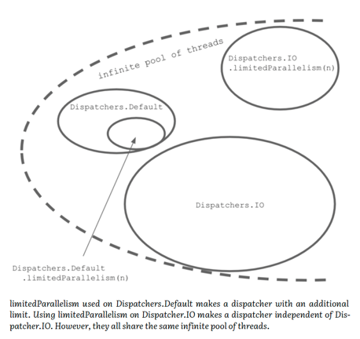
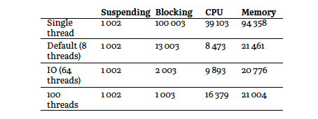

# Exception handling

어떤 스레드에서 코루틴을 실행할지 결정하는 기능에 대해 이야기 해보자  
이 기능은 디스패쳐가 담당한다  

## Default dispatcher

- 기본으로 설정되는 디스패처
- CPU intensive 한 작업에 사용되도록 설계됨 
- 스레드풀의 개수는 코어수와 동일함 

```kotlin
suspend fun defaultDispatcherEx() = coroutineScope {
    repeat(1000) {
        launch { // or launch(Dispatchers.Default) {
            // To make it busy
            List(1000) { Random().nextLong() }.maxOrNull()
            val threadName = Thread.currentThread().name
            println("Running on thread: $threadName")
        }
    }
}
```

만약 위 코드에서 coroutineScope 대신에 runBlocking 을 사용하게 되면, default 디스패처가 아닌 다른 디스패처가 할당됨

### Limiting the default dispatcher

`limitedParallelism` 을 활용해 사용할 스레드 수를 제한할 수 있음  

### IO dispatcher

IO 작업에 권장되는 디스패처  
스레드풀의 스레드 개수 제한은 기본 64

```kotlin
suspend fun ioDispatcherEx() {
    val time = measureTimeMillis {
        coroutineScope {
            repeat(50) {
                launch(Dispatchers.IO) {
                    Thread.sleep(1000)
                }
            }
        }
    }
    println(time) // ~1000
}
```

default, io 디스패처의 스레드풀의 경우 같은 풀을 공유함(스레드를 재사용할 수 있게 되고, 스레드 재배치가 필요없을 수 있음)  
그렇기에 부모 코루틴에서 default 디스패처를 사용하다가, 자식 코루틴에서 io 디스패처로 수정하게 되었을 때 스레드가 바뀌지 않을 수 있음  

```kotlin
suspend fun ioDispatcherEx2(): Unit = coroutineScope {
    launch(Dispatchers.Default) {
        println(Thread.currentThread().name)
        withContext(Dispatchers.IO) {
            println(Thread.currentThread().name)
        }
    }
}
// DefaultDispatcher-worker-2
// DefaultDispatcher-worker-2
```

default, io 의 디스패처를 최대로 사용한다고 가정하자  
그러면 활성화된 스레드의 수는 default 디스패처의 스레드 제한수와 io 디스패처의 스레드 제한 수의 합과 동일할 것임  

## IO dispatcher with a custom pool of threads

io 디스패처의 경우, limitedParallelism 을 활용하여 독립적인 스레드 제한 개수를 가지는 디스패처를 만들 수 있음 

```kotlin
suspend fun printCoroutineTimeEx(): Unit = coroutineScope {
    launch {
        printCoroutinesTime(Dispatchers.IO)
        // Dispatchers.IO took: 2074
    }
    launch {
        val dispatcher = Dispatchers.IO
            .limitedParallelism(100)
        printCoroutinesTime(dispatcher)
        // LimitedDispatcher@XXX took: 1082
    }
}

suspend fun printCoroutinesTime(
    dispatcher: CoroutineDispatcher
) {
    val test = measureTimeMillis {
        coroutineScope {
            repeat(100) {
                launch(dispatcher) {
                    Thread.sleep(1000)
                }
            }
        }
    }
    println("$dispatcher took: $test")
}
```



그림을 보면 알 수 있듯이
- default 디스패처에서의 limitedParallelism 은 기존 디스패처 내부에서 추가적인 풀을 정의함
- io 디스패처에서의 limitedParallelism 은 기존 디스패처와는 독립적인 풀을 정의함

기존 디스패처와는 독립적인 풀을 설정한다는 것에서, 다른 디스패처에게 영향을 끼치지 않는 것을 알 수 있음 
-> 그렇지만 결국 위 그림에서 infinite pool of threads 의 개수도 결국 제한이 있을것이기에, 스레드 수 제한은 신중히 결정할 필요가 았을것 같다


## Dispatcher with a fixed pool of threads

개발자들이 직접 스레드 풀을 정의하여 디스패처를 선언할 수도 있음  
하지만 이 사용법의 문제점은, 개발자가 직접 스레드 풀을 close 해야 한다는 것임  
그리고 스레드 수를 더 많이 설정하게 되면, 불필요한 스레드가 다른 서비스와 공유되지 않고 점유되고 있을 수 있음

```kotlin
val NUMBER_OF_THREADS = 20
val dispatcher = Executors
    .newFixedThreadPool(NUMBER_OF_THREADS)
    .asCoroutineDispatcher()
```

## Dispatcher limited to a single thread

싱글 스레드 디스패처를 선언하기 위해서는, 앞서 설명한 것처럼 직접 스레드 풀을 생성하여 선언하기 보다는, 아래와 같은 방법을 추천함  

```kotlin
var i = 0
suspend fun main(): Unit = coroutineScope {
    val dispatcher = Dispatchers.Default
        .limitedParallelism(1)
    repeat(10000) {
        launch(dispatcher) {
            i++
        }
    }
    delay(1000)
    println(i) // 10000
}
```

## Unconfined dispatcher

이 디스패처의 경우, 스레드를 바꾸지 않는 다는 점에서 차이점을 가짐  
코루틴이 시작되면, 시작된 스레드에서 이어감  
코루틴이 재개되면, 재개된 스레드에서 이어감 

```kotlin
suspend fun unconfinedDispatcherEx(): Unit =
    withContext(newSingleThreadContext("Thread1")) {
        var continuation: Continuation<Unit>? = null
        launch(newSingleThreadContext("Thread2")) {
            delay(1000)
            continuation?.resume(Unit)
        }
        launch(Dispatchers.Unconfined) {
            println(Thread.currentThread().name) // Thread1
            suspendCancellableCoroutine<Unit> {
                continuation = it
            }
            println(Thread.currentThread().name) // Thread2
            delay(1000)
            println(Thread.currentThread().name)
            // kotlinx.coroutines.DefaultExecutor
            // (used by delay)
        }
    }
```

성능 관점에서 이 디스패처는 매우 저렴함  
스레드 스위칭이 일어나지 않기 때문임  
하지만 운영환경에서 실제로 사용하기에는 무리가 있음 
-> 만약 Main 스레드에서 실행된다면, 전체 application의 blocking 으로 이어질 수 있기 때문임

## Immediate main dispatching

코루틴을 디스패칭하는데에는 비용이 든다  
withContext() 가 호출되었을 때, 코루틴은 지연되고, 큐에서 기다릴 수도 있고, 그 후에야 재게된다.  
이는 작지만 불필요한 비용일 수 있다  
그렇기에 만약 재배치가 불필요하면 기존 스레드에서 지속하는 Dispatchers.Main.immediate 를 지원한다  

```kotlin
suspend fun showUser(user: User) =
    withContext(Dispatchers.Main.immediate) {
        userNameElement.text = user.name
        // ...
    }
```

## Continuation interceptor

디스패칭은 continuation interception 메카니즘으로 동작함  

코루틴 콘텍스트 중에 ContinuationInterceptor 가 있음   
interceptContinuation() 함수는 코루틴이 suspend 되었을때 continuation 을 수정하기 위해 사용됨  
releaseInterceptedContinuation() 함수는 continuation 이 종료되면 호출됨  

```kotlin
public interface ContinuationInterceptor :
    CoroutineContext.Element {
    companion object Key :
        CoroutineContext.Key<ContinuationInterceptor>
    fun <T> interceptContinuation(
        continuation: Continuation<T>
    ): Continuation<T>
    fun releaseInterceptedContinuation(
        continuation: Continuation<*>
    ) {
    }
//...
}
```

디스패처들은 interceptContinuation() 을 활용해, DispatchedContinuation 을 wrap 함  

## Performance of dispatchers against different tasks

다음은 저자가 다양한 디스패처들의 성능을 측정하기 위해 다양한 작업에 활용해본 결과이다  



1. suspend 될때는, 스레드 개수는 중요하지 않음
2. blocking 작업에서는, 스레드가 많을 수록 더 수행시간이 짧음
3. cpu intensive 한 작업에서는, Dispatchers.Default 가 가장 좋은 옵션임
4. memory intensive 한 작업에서는, 대체로 스레드 수가 많을 수록 유리함


# Coroutine scope functions

```kotlin
```
