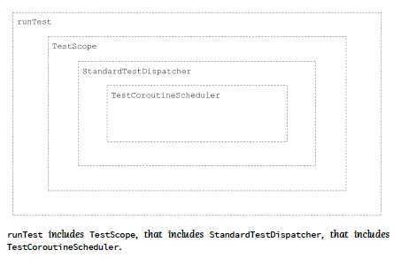

# The problem with shared state

아래 코드를 보자  
문제점이 있는데, 바로 동시성 문제이다

하나 이상의 스레드가 동시에 users 리스트에 접근하여 수정하게 된다면,  
users 는 shared state 이고 예상된 결과를 얻지 못할 수 있다

```kotlin
class UserDownloader(
    private val api: NetworkService
) {
    private val users = mutableListOf<User>()

    fun downloaded(): List<User> = users.toList()

    suspend fun fetchUser(id: Int) {
        val newUser = api.fetchUser(id)
        users.add(newUser)
    }
}
```

예를 들어 아래 코드는, 기대했던 1000000을 리턴하지 않는다

```kotlin
class FakeNetworkService : NetworkService {
    override suspend fun fetchUser(id: Int): User {
        delay(2)
        return User(id, "User$id")
    }
}
suspend fun main() {
    val downloader = UserDownloader(FakeNetworkService())
    coroutineScope {
        repeat(1_000_000) {
            downloader.fetchUser(it)
        }
    }
    println(downloader.downloaded().size)
}
```

아래와 같은 예제에서도 마찬가지로 기대 했던 결과를 볼 수 없다  
- 두 스레드가 동시에 counter 변수를 읽고 1을 더한 후 다시 변수에 값을 저장하면
- 2가 저장되어야 하지만, 실제로는 1이 저장되어 값의 오차가 생긴다

```kotlin
fun main() = runBlocking {
    massiveRun { counter++ }
    println("Counter = $counter")
}

suspend fun massiveRun(action: suspend () -> Unit) =
    withContext(Dispatchers.Default) {
        repeat(1000) {
            launch {
                repeat(1000) {
                    action()
                }
            }
        }
    }
```

## Blocking synchronization

위 문제는 Java 에서 전통적으로 사용하는 synchronized block 을 활용해서 해결 할 수 있음  

```kotlin
fun main() = runBlocking {
    val lock = Any()
    massiveRun {
        synchronized(lock) {
            counter++
        }
    }
    println("Counter = $counter")
}
```

- 그렇지만 synchronized 블록 안에서는 다른 suspend 함수를 호출 할 수 없고
- synchronized 의 경우 스레드를 블록 하기에
최선의 방법이라고 볼 수 없다

## Atomics

Java 에는 atomic value 가 있다  
이 값들의 연산은 thread-safe 한 특징이 있음
- 한마디로 값을 읽고 쓰는 것의 동시성 보장이 된다는 의미이다

이 들의 연산은 락을 사용하지 않고, low-level 에서 보장되기에 
- 효율적이고
- 코루틴의 접근방식에 적절함

```kotlin
private val atomicCounter = AtomicInteger()

fun main() = runBlocking {
    massiveRun {
        atomicCounter.incrementAndGet()
    }
    println("Counter = $atomicCounter") // 1000000
}
```

정확하게 동작하지만, 이 방법은 활용성이 떨어짐  
- 만약 다수의 operation 들의 동시성을 보장해야 한다면 활용이 어려울 수 있음

```kotlin
private var counter = AtomicInteger()

fun main() = runBlocking {
    massiveRun {
        counter.set(counter.get() + 1)
    }
    println("Counter = $atomicCounter") // ~430467
}
```

AtomicReference 를 활용해 컬렉션의 동시성을 보장할 수 있음

```kotlin
class UserDownloader(
    private val api: NetworkService
) {
    private val users = AtomicReference(listOf<User>())

    fun downloaded(): List<User> = users.get()

    suspend fun fetchUser(id: Int) {
        val newUser = api.fetchUser(id)
        users.getAndUpdate { it + newUser }
    }
}
```

## A dispatcher limited to a single thread

가장 편리한 방법은 싱글 스레드를 가지는 디스패처를 활용하는 것이다

```kotlin
val dispatcher = Dispatchers.IO
    .limitedParallelism(1)

fun main() = runBlocking {
    massiveRun {
        withContext(dispatcher) {
            counter++
        }
    }
    println(counter) // 1000000
}
```

위 방식은 2가지 접근으로 활용할 수 있음  

1. coarse-grained thread confinement
    - 이 방식은 전체 함수를 해당 디스패처를 가지는 코루틴스코프로 감싸는 것
    - 쉽고, 충돌을 방지하지만
    - 멀티스레딩의 장점을 포기함

```kotlin
class UserDownloader(
    private val api: NetworkService
) {
    private val users = mutableListOf<User>()
    private val dispatcher = Dispatcher.IO.limitedParallelism(1)

    fun downloaded(): List<User> = 
        withContext(dispatcher) {
            users.toList()
        }

    suspend fun fetchUser(id: Int) = wihtContext(dispatcher) {
        val newUser = api.fetchUser(id)
        users.add(newUser)
    }
}
```

위 코드에서, `api.fetchUser` 의 경우 멀티스레드 환경에서 동시에 실행될 수 있는 작업이다.  
하지만 현재는 싱글 스레드로 동작하여 성능 저하가 있다.
- 정리하면, blocking 되거나 cpu-intensive 한 작업이 코루틴 스코프안에 포함되면 성능저하가 있을 수 있다

2. fine-grained thread confinement
   - 이 방식은 state 를 변경하는 곳에만 코루틴 스코프를 활용한다
   - blocking 되거나 cpu-intensive 한 작업의 경우 제외할 수 있어, coarse-grained 방식보다 성능 좋음

```kotlin
class UserDownloader(
    private val api: NetworkService
) {
    private val users = mutableListOf<User>()
    private val dispatcher = Dispatcher.IO.limitedParallelism(1)

    fun downloaded(): List<User> = 
        withContext(dispatcher) {
            users.toList()
        }

    suspend fun fetchUser(id: Int) {
        val newUser = api.fetchUser(id)
        withContext(dispatcher) {
            users.add(newUser)
        }
    }
}
```

## Mutex

마지막 접근은 Mutex를 활용하는 것이다  
하나의 키를 가지는 화장실이나 방을 생각하면 된다  
- lock 을 가지는 첫 코루틴은 suspension 없이 코드 수행
- 두번째로 온 코루틴은 lock을 가질 수 없고 suspend 되었다가, 첫 코루틴이 unlock 하면 코드 수행

```kotlin
suspend fun main() = coroutineScope {
    repeat(5) {
        launch {
            delayAndPrint()
        }
    }
}

val mutex = Mutex()

suspend fun delayAndPrint() {
    mutex.lock()
    delay(1000)
    println("Done")
    mutex.unlock()
}
// (1 sec)
// Done
// (1 sec)
// Done
// (1 sec)
// Done
// (1 sec)
// Done
// (1 sec)
// Done
```

lock() 과 unlock() 을 직접적으로 사용하는 것은 위험하다  
만약 중간에 exception 이 발생한다면, unlock() 영영 호출되지 않을 수도 있기 때문이다  
그렇기에 withLock() 을 사용하는 것을 추천한다  

synchronized 블록과의 중요한 차이점이자 장점은  
- 스레드를 블로킹하지 않고, 코루틴을 서스펜드 시킨다는 점이다  
  - 이는 더 가벼운 방식임  

그렇지만 단점은  
- lock을 2번 사용할 수 없다는 점
- suspend 되었을때 unlock 하지 않는 다는 점


아래 코드는 데드락이 발생할 것이다 

```kotlin
suspend fun main() {
    val mutex = Mutex()
    println("Started")
    mutex.withLock {
        mutex.withLock{
            println("Will never be printed")
        }
    }
}
```

아래 코드는 5초정도 걸린다  
왜냐하면 delay() 동안 해당 코루틴이 lock 을 잡고 있기 때문임 

```kotlin
class MessagesRepository {
    private val messages = mutableListOf<String>()
    private val mutex = Mutex()
    suspend fun add(message: String) = mutex.withLock {
        delay(1000) // we simulate network call
        messages.add(message)
    }
}
suspend fun main() {
    val repo = MessagesRepository()
    val timeMillis = measureTimeMillis {
        coroutineScope {
            repeat(5) {
                launch {
                    repo.add("Message$it")
                }
            }
        }
    }
    println(timeMillis) // ~5120
}
```

만약 앞서 설명한 싱글스레드 디스패처 방식을 활용한다면, 이 문제는 해결 할 수 있음

## Semaphore

Mutex 와 동일하지만, 복수개의 permit 을 가질 수 있는 개념이다  
사실 동시성문제에서는 permit을 하나만 허용해야 되기에  
실제로 활용할 수 있는 예제는 rate limiting 정도 일 것이다 

---

# Testing Kotlin Coroutines

코루틴의 테스트코드는 일반적인 테스트코드 작성과 별반 다르지 않다  
사실 코루틴이 제대로 동작하는 지 테스트하기 위해서는, 앞서 살펴봤던 runBlocking() 이나 asserting 을 위한 기존 도구들을 활용하면 됨  

## Testing time dependencies

그렇지만 수행시간을 고려하게 된다면, 다른 도구들이 필요하다  
아래 코드는 같은 결과를 도출하지만, 코루틴 사용여부에 따라 순차적 혹은 동시에 작업을 처리한다  

```kotlin
suspend fun productCurrentUserSeq(): User {
    val profile = repo.getProfile()
    val friends = repo.getFriends()
    return User(profile, friends)
}
suspend fun productCurrentUserSym(): User {
    val profile = async { repo.getProfile() }
    val friends = async { repo.getFriends() }
    return User(profile.await(), friends.await())
}

```

아래와 같은 코드를 활용하여 테스트를 진행한다면,
- seq 의 경우 2초가 걸리고
- sym 의 경우 1초가 걸린다

그러나 우리는 unit test 에서 실제로 위 시간이 걸리기를 바라지는 않는다  
그렇기에 time 을 simulate 하는 도구가 필요하다  

```kotlin
class FakeDelayedUserDataRepository : UserDataRepository {
    override suspend fun getProfile(): Profile {
        delay(1000)
        return Profile("Example description")
    }
    override suspend fun getFriends(): List<Friend> {
        delay(1000)
        return listOf(Friend("some-friend-id-1"))
    }
}
```

## TestCoroutineScheduler and StandardTestDispatcher

TestCoroutineScheduler 를 활용해 실제로 delay 되는 시간을 simulate 할 수 있다  

```kotlin
fun main() {
    val scheduler = TestCoroutineScheduler()
    
    println(scheduler.currentTime) // 0
    scheduler.advanceTimeBy(1_000)
    println(scheduler.currentTime) // 1000
    scheduler.advanceTimeBy(1_000)
    println(scheduler.currentTime) // 2000
}
```

위 스케줄러를 활용하기 위해서는 이를 지원하는 dispatcher 를 사용해야 한다  
기본적으로 StandardTestDispatcher 가 존재한다  
- 이 디스패처의 경우 어느 스레드에서 코루틴이 동작할지 정하는 역할을 하는것이 아니라, 가상 시간을 simulate 하기 전에 코루틴이 동작하는 것을 막는 역할을 한다  
    - 이를 위한 대표적인 함수는 `advanceUntilIdle()` 이다 / 이는 수행 될 모든 연산을 가상 시간으로 simulate 한다

```kotlin
fun main() {
    val scheduler = TestCoroutineScheduler()
    val testDispatcher = StandardTestDispatcher(scheduler)
    CoroutineScope(testDispatcher).launch {
        println("Some work 1")
        delay(1000)
        println("Some work 2")
        delay(1000)
        println("Coroutine done")
    }
    println("[${scheduler.currentTime}] Before")
    scheduler.advanceUntilIdle()
    println("[${scheduler.currentTime}] After")
}
// [0] Before
// Some work 1
// Some work 2
// Coroutine done
// [2000] After
```

기본적으로 StandardTestDispatcher 는 스케줄러로 StandardTestDispatcher 를 가지기에, 우리가 명시적으로 선언할 필요는 없다  
주의해야 할 점은, 이 디스패처는 가상시간을 simulate 하지 않기 때문에 우리가 코드를 통해 직접 명령을 내려 가상 시간을 simulate 해야 한다

advanceTimeBy() 함수를 통해 구체적으로 simulate 할 시간을 설정할 수 있다  
인자 미만의 시간 범위 까지의 수행 되어야 할 연산들을 수행한다  

특정 시간 지점의 연산을 수행하기 위해서는, runCurrent 함수를 수행해야 한다  

StandardTestDispatcher 를 감싸고 있는 TestScope 가 존재한다  

```kotlin
fun main() {
    val scope = TestScope()
    scope.launch {
        delay(1000)
        println("First done")
        delay(1000)
        println("Coroutine done")
    }
    println("[${scope.currentTime}] Before") // [0] Before
    scope.advanceTimeBy(1000)
    scope.runCurrent() // First done
    println("[${scope.currentTime}] Middle") // [1000] Middle
    scope.advanceUntilIdle() // Coroutine done
    println("[${scope.currentTime}] After") // [2000] After
}
```

## runTest

이 함수는 
- TestScope 로 코루틴을 실행하고
- 가상시간을 idle 될때까지 advance 한다 

그래서 아래와 같이 현재 시간을 확인 할 수 있다 

```kotlin
class TestTest {
    @Test
    fun test1() = runTest {
        assertEquals(0, currentTime)
        delay(1000)
        assertEquals(1000, currentTime)
    }
    @Test
    fun test2() = runTest {
        assertEquals(0, currentTime)
        coroutineScope {
            launch { delay(1000) }
            launch { delay(1500) }
            launch { delay(2000) }
        }
        assertEquals(2000, currentTime)
    }
}
```

앞서 살펴봤던 data를 순차적 혹은 동시에 불러오는 예제는 runTest를 활용하여 아래와 같이 구현할 수 있다 
```kotlin
@Test
fun `Should produce user sequentially`() = runTest {
    // given
    val userDataRepository = FakeDelayedUserDataRepository()
    val useCase = ProduceUserUseCase(userDataRepository)
    // when
    useCase.produceCurrentUserSeq()
    // then
    assertEquals(2000, currentTime)
}
@Test
fun `Should produce user simultaneously`() = runTest {
    // given
    val userDataRepository = FakeDelayedUserDataRepository()
    val useCase = ProduceUserUseCase(userDataRepository)
    // when
    useCase.produceCurrentUserSym()
    // then
    assertEquals(1000, currentTime)
}

```

정리하면 아래와 같은 구조를 가지는 모듈이다 




## Background scope

앞서 살펴봤던 runTest 함수는 scope 를 생성한다.  
그리고 자식 코루틴이 종료될때 까지 기다린다  
이 말은 자식 코루틴이 종료되지 않으면, 이 코루틴은 영영 멈추지 않는 다는 것이다  

이런 상황에서는 backgroundScope 를 활용 할 수 있다 

```kotlin
@Test
fun backgroundTest() = runTest {
    var i = 0
    backgroundScope.launch {
        while (true) {
            delay(1000)
            i++
        }
    }
    delay(1001)
    assertEquals(1, i)
    delay(1000)
    assertEquals(2, i)
}
```

## Testing cancellation and context passing

structured concurrency 를 확인하기 위해서는, 코루틴 빌더나 스코프의 람다 표현식에서 currentCoroutineContext() 함수를 호출하여 확인할 수 있다  

cancellation 을 확인하기 위해서는, 부모 코루틴을 cancel 하고, 자식 코루틴의 job 을 확인하여 실제 cancel 되었는지 확인하는 방식을 활용할 수 있다  
그러나 실제로 위 경우를 테스트 할 필요는 없을 것이다  

## UnconfinedTestDispatcher 

앞서 살펴본 StandardTestDispatcher 와의 차이점은 첫 delay 전에 모든 연산을 즉시 수행한다는 점이다  
아래 예제를 살펴보면 이 dispatcher 를 사용한 경우, 바로 'C' 를 출력하는 것을 볼 수 있다  

```kotlin
fun main() {
    CoroutineScope(StandardTestDispatcher()).launch {
        print("A")
        delay(1)
        print("B")
    }
    CoroutineScope(UnconfinedTestDispatcher()).launch {
        print("C")
        delay(1)
        print("D")
    }
}
// C
```

## Using mocks

fake 에 delay 를 사용하는 것은, 쉽지만 불명확하다  
그래서 우리는 mock 을 자주 사용한다 

아래와 같이 활용 할 수 있다 

```kotlin
@Test
fun `should load data concurrently`() = runTest {
    // given
    val userRepo = mockk<UserDataRepository>()
    coEvery { userRepo.getName() } coAnswers {
        delay(600)
        aName
    }
    coEvery { userRepo.getFriends() } coAnswers {
        delay(700)
        someFriends
    }
    coEvery { userRepo.getProfile() } coAnswers {
        delay(800)
        aProfile
    }
    val useCase = FetchUserUseCase(userRepo)
        
    // when
    useCase.fetchUserData()
        
    // then
    assertEquals(800, currentTime)
}
```

## Testing functions that change a dispatcher

아래와 같은 함수들이 있다고 하자  
만약 실제로 위 함수들에서 dispatcher 가 교체되는 지 테스트해야한다면 어떻게 할까?

```kotlin
suspend fun readSave(name: String): GameState =
    withContext(Dispatchers.IO) {
        reader.readCsvBlocking(name, GameState::class.java)
    }
suspend fun calculateModel() =
    withContext(Dispatchers.Default) {
        model.fit(
            dataset = newTrain,
            epochs = 10,
            batchSize = 100,
            verbose = false
        )
    }
```

아래와 같이 확인 할 수 있다 

```kotlin
@Test
fun `should change dispatcher`() = runBlocking {
    // given
    val csvReader = mockk<CsvReader>()
    val startThreadName = "MyName"
    var usedThreadName: String? = null
    every {
        csvReader.readCsvBlocking(
            aFileName,
            GameState::class.java
        )
    } coAnswers {
        usedThreadName = Thread.currentThread().name
        aGameState
    }
    val saveReader = SaveReader(csvReader)
        
    // when
    withContext(newSingleThreadContext(startThreadName)) {
        saveReader.readSave(aFileName)
    }
        
    // then
    assertNotNull(usedThreadName)
    val expectedPrefix = "DefaultDispatcher-worker-"
    assert(usedThreadName!!.startsWith(expectedPrefix))
}
```

만약 dispatcher 가 교체되는 케이스에서, time dependencies 를 테스트해야한다면 어떻게 할까?  
이 경우에는 디스패처를 생성자에 주입하는 방식으로 코드가 구성되어 있어야 한다  

실제 사용되는 디스패처 대신에 StandardTestDispatcher 를 주입하여 테스트코드가 진행되게 해야 한다  

## Testing what happens during function execution

아래와 같이 프로그레스 바를 보여주었다가 사라지는 프로세스가 포함된 함수를 보자  

```kotlin
suspend fun sendUserData() {
    val userData = database.getUserData()
    progressBarVisible.value = true
    userRepository.sendUserData(userData)
    progressBarVisible.value = false
}
```

이 함수의 결과만 보면, 기대했던 대로 프로그레스바가 보여줬다가 사라졌는지 확인할 수 없다  
이런 경우에는 가상시간을 simulate 해가면서 프로그레스바가 보여졌는지 확인하면 된다  

```kotlin
@Test
fun `should show progress bar when sending data`() = runTest {
    // given
    val database = FakeDatabase()
    val vm = UserViewModel(database)
        
    // when
    launch {
        vm.sendUserData()
    }
        
    // then
    assertEquals(false, vm.progressBarVisible.value)
        
    // when
    advanceTimeBy(1000)
        
    // then
    assertEquals(false, vm.progressBarVisible.value)
        
    // when
    runCurrent()
        
    // then
    assertEquals(true, vm.progressBarVisible.value)
        
    // when
    advanceUntilIdle()
        
    // then
    assertEquals(false, vm.progressBarVisible.value)
}
```

## Setting a test dispatcher with a rule 
JUnit4 에서는 룰을 설정할 수 있다  
- 이는 before, after 테스트에 어떤 작업을 수행할지 정해놓는 것이다 
- 이런 룰은 TestWatcher 를 상속해야 한다


