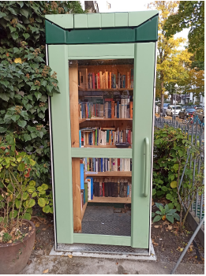
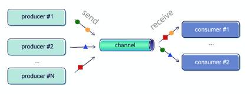
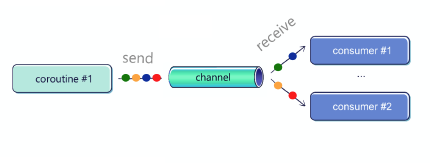
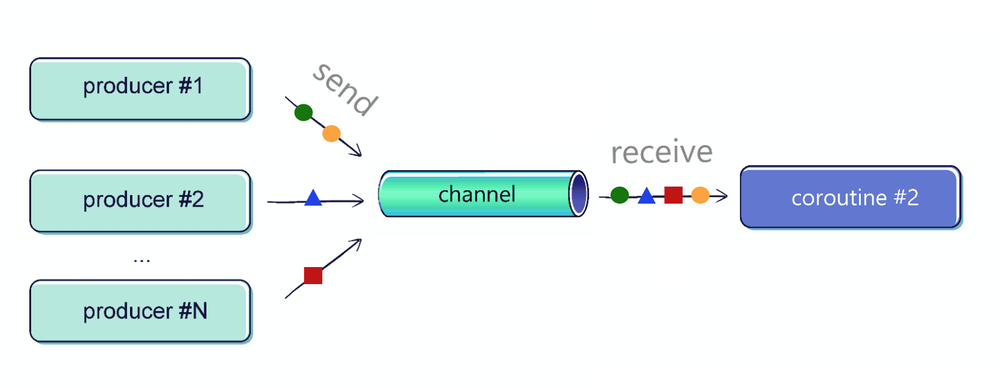
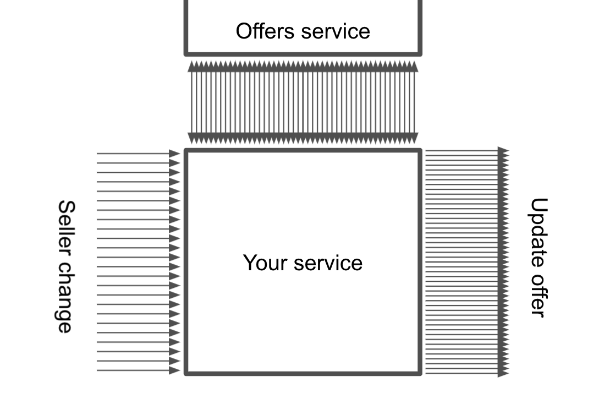
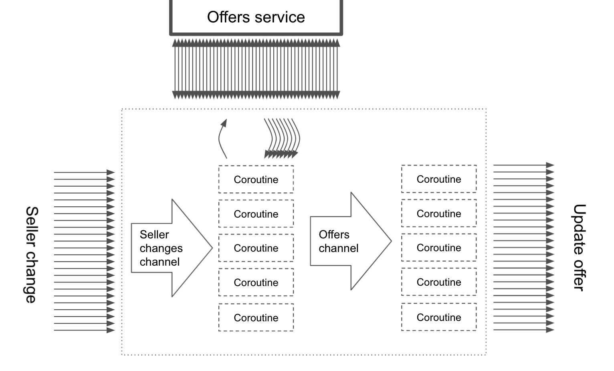

# Part3: Channel and Flow

## Channel

채널이란?
- 코루틴간의 통신을 위한 API
- 저자는 public bookcase 를 비유로 듬

  


- 채널은 sender, receiver의 수를 얼마든 설정할 수 있음 
- 채널로 보내진 value는 한 번만 receive 되는 것을 보장함

  

---

구현?

- Channel은 아래 인터페이스 2개를 구현하는 인터페이스
  - SendChannel : 요소 보내고, 채널 닫는 역할
  - ReceiveChannel : 요소 받는 역할

  ```kotlin
  interface SendChannel<in E> {
    suspend fun send(element: E)
    fun close(): Boolean
    //...
  }

  interface ReceiveChannel<out E> {
    suspend fun receive(): E
    fun cancel(cause: CancellationException? = null)
    // ...
  }

  interface Channel<E> : SendChannel<E>, ReceiveChannel<E>

  ```

- 이런 특징으로 인해, 진입점을 2개로 제한할 수 있음
- 주목할 점은, send()와  receive() 가 suspend 함수라는 것
  - receive 하려고 하는데, 요소가 없다면? 코루틴은 요소가 생길 때까지 지연 됨
  - send 하려고 하는데, 채널의 용량이 부족하다면? 마찬가지로 지연 됨

- 만약 non-suspending 함수에서, 위 기능이 필요하다면 trySend(), tryReceive() 를 활용할 것
  - rendezvous channel 에서는 동작 안 함


---

간단한 예제?

  ```kotlin
  suspend fun main(): Unit = coroutineScope {
      val channel = Channel<Int>()
      launch {
          repeat(5) { index ->
              delay(1000)
              println("Producing next one")
              channel.send(index * 2)
          }
      }
      launch {
          repeat(5) {
              val received = channel.receive()
              println(received)
          }
      }
  }
  // (1 sec)
  // Producing next one
  // 0
  // (1 sec)
  // Producing next one
  // 2
  // (1 sec)
  // Producing next one
  // 4
  // (1 sec)
  // Producing next one
  // 6
  // (1 sec)
  // Producing next one
  // 8
  ```
- 위 코드의 문제점은 receiver 가 얼마나 받을지 미리 알고 있어야 함 -> 이런 경우는 드물듯
- 채널이 닫힐때까지, 받으려면 아래와 같이 
  ```kotlin
  suspend fun main(): Unit = coroutineScope {
      val channel = Channel<Int>()
      launch {
          repeat(5) { index ->
              println("Producing next one")
              delay(1000)
              channel.send(index * 2)
          }
          channel.close()
      }
      launch {
          for (element in channel) {
              println(element)
          }
          // or
          // channel.consumeEach { element ->
          //  println(element)
          // }
      }
  }
  ```
- 위 코드의 문제점은 채널 닫는 것을 잊기 쉽다는 점 
  - 만약 producer 에서 예외가 발생하여 채널 닫지 않고 끝나면 -> receiver 에서 영원히 기다림

- 이럴때는 produce()를 쓰자
  - 코루틴 빌더이며, ReceiveChannel 을 리턴한다 
  - 빌더 코루틴이 끝나면, 채널을 닫는다 

  ```kotlin
  // This function produces a channel with
  // next positive integers from 0 to `max`
  fun CoroutineScope.produceNumbers(
      max: Int
  ): ReceiveChannel<Int> = produce {
      var x = 0
      while (x < 5) send(x++)
  }

  suspend fun main(): Unit = coroutineScope {
      val channel = produce {
          repeat(5) { index ->
              println("Producing next one")
              delay(1000)
              send(index * 2)
          }
      }
      for (element in channel) {
          println(element)
      }
  }
  ```

---

Channel types?

- 채널의 용량에 따라 4가지로 나눌 수 있음
  - Unlimited : 용량 무제한 
  - Buffered : 특정 크기 혹은 Channel.BUFFERED(64 or overrid by system property)
  - Rendezvous (Default) : 0 임. element 의 교환은 sender와 receiver 의 만남으로부터 like 당근 
  - Conflated : 1 임. 그리고 새로 들어온 element 들은 기존 것을 교체함

- 용법
  - `produce(capacity = Channel.UNLIMITED) { ... }`
  - `produce(capacity = 3) { ... }`
  - `produce { ... }` : producer는 항상 receiver 를 기다림
  - `produce(capacity = Channel.CONFLATED) { ... }`

- 아래는 Conflated 예제 
  ```kotlin
  suspend fun main(): Unit = coroutineScope {
      val channel = produce(capacity = Channel.CONFLATED) {
          repeat(5) { index ->
              send(index * 2)
              delay(100)
              println("Sent")
          }
      }
      delay(1000)
      for (element in channel) {
          println(element)
          delay(1000)
      }
  }
  // Sent
  // (0.1 sec)
  // Sent
  // (0.1 sec)
  // Sent
  // (0.1 sec)
  // Sent
  // (0.1 sec)
  // Sent
  // (1 - 4 * 0.1 = 0.6 sec)
  // 8
  ```

---


On buffer overflow?


- onBufferOverflow 파라미터를 활용하여, 버퍼가 넘치면 할 동작을 설정 가능
  - SUSPEND(Default)
  - DROP_OLDEST
  - DROP_LATEST

- produce() 함수에서는 위 기능을 설정할 수 없어서, 위 기능을 활용하기 위해서는 Channel 을 직접 설정해야 함


  ```kotlin
  suspend fun main(): Unit = coroutineScope {
      val channel = Channel<Int>(
          capacity = 2,
          onBufferOverflow = BufferOverflow.DROP_OLDEST
      )
      launch {
          repeat(5) { index ->
              channel.send(index * 2)
              delay(100)
              println("Sent")
          }
          channel.close()
      }
      delay(1000)
      for (element in channel) {
          println(element)
          delay(1000)
      }
  }
  // Sent
  // (0.1 sec)
  // Sent
  // (0.1 sec)
  // Sent
  // (0.1 sec)
  // Sent
  // (0.1 sec)
  // Sent
  // (1 - 4 * 0.1 = 0.6 sec)
  // 6
  // (1 sec)
  // 8
  ```

---

On undelivered element handler?

- onUndeliveredElement 파라미터 
  - 대부분의 경우 채널이 닫히거나/취소되거나/ send, receive, receiveOrNull, hasNext 가 error를 던진 경우
  - 리소스를 정리하기 위해 사용함

  ```kotlin
  val channel = Channel<Resource>(capacity) { resource ->
      resource.close()
  }
  // or
  // val channel = Channel<Resource>(
  // capacity,
  // onUndeliveredElement = { resource ->
  // resource.close()
  // }
  // )
  // Producer code
  val resourceToSend = openResource()
  channel.send(resourceToSend)
  // Consumer code
  val resourceReceived = channel.receive()
  try {
  // work with received resource
  } finally {
      resourceReceived.close()
  }
  ```

---


Fan-out?



- 앞서 언급한 consumeEach 는 안전하지 않기에, for-loop 를 사용해야 함

  ```kotlin
  fun CoroutineScope.produceNumbers() = produce {
      repeat(10) {
          delay(100)
          send(it)
      }
  }
  fun CoroutineScope.launchProcessor(
      id: Int,
      channel: ReceiveChannel<Int>
  ) = launch {
      for (msg in channel) {
          println("#$id received $msg")
      }
  }
  suspend fun main(): Unit = coroutineScope {
      val channel = produceNumbers()
      repeat(3) { id ->
          delay(10)
          launchProcessor(id, channel)
      }
  }
  // #0 received 0
  // #1 received 1
  // #2 received 2
  // #0 received 3
  // #1 received 4
  // #2 received 5
  // #0 received 6
  // ...
  ```

- 채널은 FIFO 큐를 활용하여 코루틴을 보관

---


Fan-in?



  ```kotlin
  suspend fun sendString(
      channel: SendChannel<String>,
      text: String,
      time: Long
  ) {
      while (true) {
          delay(time)
          channel.send(text)
      }
  }
  fun main() = runBlocking {
      val channel = Channel<String>()
      launch { sendString(channel, "foo", 200L) }
      launch { sendString(channel, "BAR!", 500L) }
      repeat(50) {
          println(channel.receive())
      }
      coroutineContext.cancelChildren()
  }
  // (200 ms)
  // foo
  // (200 ms)
  // foo
  // (100 ms)
  // BAR!
  // (100 ms)
  // foo
  // (200 ms)
  // ...
  ```


- 만약, 다수의 채널을 하나로 합쳐야 한다면?
  - 아래와 같이 활용할 수 있다
  ```kotlin
  fun <T> CoroutineScope.fanIn(
    channels: List<ReceiveChannel<T>>
  ): ReceiveChannel<T> = produce {
    for (c in channels) {
      launch {
        for (e in c) {
          send(e)
        }
      }
    }
  }
  ```


---

pipelines?

- 한 채널이 produce, 다른 채널이 receive 하는 구조를 pipeline 이라 함 (연결되어 있는 구조)

---

Channels as a communication primitive

- 채널은 다른 코루틴들이 서로 통신해야할 때 사용할 수 있음
  - 충돌(공유자원)문제 없음. 공평성 보장함.

- 예제
  - 여러 바리스타가 커피를 만들고 있는 상황
  - 각 바리스타는 자신만의 코루틴을 가지면 독립적으로 동작해야함
  - 커피 종류마다 제조 시간이 다르지만 주문순서에 맞게 처리하고 싶음

  ```kotlin
  suspend fun CoroutineScope.serveOrders(
      orders: ReceiveChannel<Order>,
      baristaName: String
  ): ReceiveChannel<CoffeeResult> = produce {
      for (order in orders) {
          val coffee = prepareCoffee(order.type)
          send(
              CoffeeResult(
                  coffee = coffee,
                  customer = order.customer,
                  baristaName = baristaName
              )
          )
      }
  }

  val coffeeResults = fanIn(
      serveOrders(ordersChannel, "Alex"),
      serveOrders(ordersChannel, "Bob"),
      serveOrders(ordersChannel, "Celine"),
  )
  ```


---

practical usage?

- 채널을 사용하는 경우는 : 한쪽에서 어떤 값을 생성하고, 다른쪽에서 그 값을 처리해야할 때

- e.g.) 스카이스캐너 : 사용자의 click 에 따른 반응 / 서버의 새로운 알림 / 검색 결과 업데이트


- 예제는 아마존과 같은 온라인 샵으로
  - 셀러들의 업데이트 사항 / 제안 업데이트 / 사용자에게 새로운 제안 보여주기 
  
  - 위 프로세스를 하나의 프로세스로 처리하는 것은 부적절함(한 셀러의 업데이트사항이 엄청 많을 수도 있음)

- 그래서 위 예제의 문제점은?
  - exception 이나 서버 재시작이 된 경우, 어디에서 멈췄는지 알 길이 없음
  - 한 셀러가 엄청나게 많은 업데이트 사항으로, blocking 할 수 도 있음 
  - 네트워크 요청을 동시에 너무 많이 보내면 안 됨 (서비스 과부화)


- 해결책으로 Channel 을 고려해 볼 수 있음
  

  - 채널들의 버퍼 용량을 조절하여, 설정된 요청수보다 많은 요청을 받지 못하게 제한 할 수 있음 
  - 중간 단계들을 커스터마이징 할 수 있음
    - 중복 요청 제거
    - 동시에 처리 가능한 요청 개수 설정
    - 서버 재시작 하는 경우 동작 설정
    - 요청의 유일성(셀러가 한 업데이트가 반영되기 전에 또 업데이트 요청을 하면?)

---

summary?

- 채널은 코루틴들 간의 통신을 위한 기초 요소이다
- produce() 를 활용하여 채널을 생성하자
- 파이프라인도 만들 수 있다
- 대부분 추후 배울 Flow를 활용하여 채널을 사용한다

---

## Select

select 함수?

- 완료된 첫번째 코루틴의 결과를 await 하게 해줌
- send 할 수 있는 버퍼 사이즈를 가진 첫 번째 채널
- receive 할 수 있는 요소를 가진 첫 번째 채널
- 이 기능은 아직 experimental

---

Selecting deferred values

- 다양한 source 에서 데이터를 가져오는 환경에서, 가장 빨리 오는 응답이 필요할때

```kotlin
suspend fun requestData1(): String {
  delay(100_000)
  return "Data1"
}
suspend fun requestData2(): String {
  delay(1000)
  return "Data2"
}

val scope = CoroutineScope(SupervisorJob())

suspend fun askMultipleForData(): String {
  val defData1 = scope.async { requestData1() }
  val defData2 = scope.async { requestData2() }
  return select {
    defData1.onAwait { it }
    defData2.onAwait { it }
  }
}

suspend fun main(): Unit = coroutineScope {
  println(askMultipleForData())
}
// (1 sec)
// Data2
```

- 주목할 점은 새로운 스코프를 사용했다는 점이다.
  - 부모 스코프를 그대로 활용하여 자식 스코프를 생성했으면, 1초가 아니라 100초 걸림

- 그래서 아래와 같이 사용하기도 함

```kotlin
suspend fun askMultipleForData(): String = coroutineScope {
  select<String> {
    async { requestData1() }.onAwait { it }
    async { requestData2() }.onAwait { it }
  }.also { coroutineContext.cancelChildren() }
}
suspend fun main(): Unit = coroutineScope {
  println(askMultipleForData())
}
// (1 sec)
// Data2
```

---

Selecting from channels

- 채널에서의 활용법
  - onReceive = 채널에 요소가 있을 때 선택됨 / 반환 결과를 람다표현식의 argument 로 제공 
  - onReceiveCatching = 채널에 요소가 있거나 채널이 닫히면 / 마찬가지로 ChannelResult(실제 반환 결과 혹은 close 여부) argument로 제공
  - onSend = 채널의 버퍼에 자리가 있어 값을 보낼 수 있을때

---

Summary

- make race between coroutine and let us know 1st 